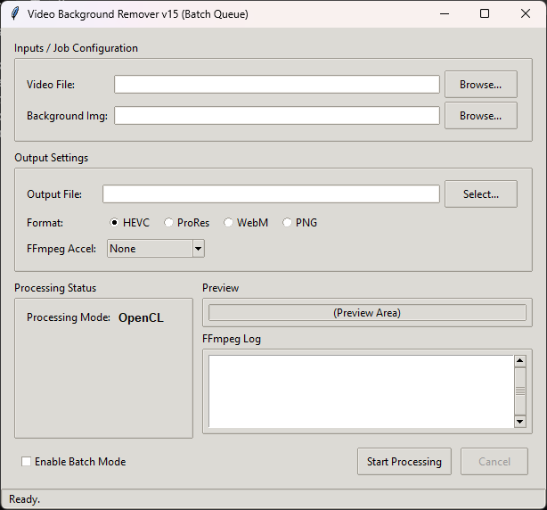
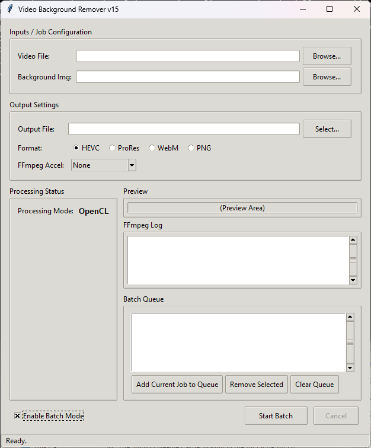

# Video Background Remover GUI

A Python-based graphical user interface (GUI) application for removing the background from videos, designed for scenarios with a static camera and a clean background plate.




## Features

* **Simple GUI:** Easy-to-use interface built with Tkinter (and optional ttkthemes).
* **Background Subtraction:** Uses OpenCV frame differencing against a provided background image to create an alpha mask.
* **Multiple Output Formats:** Encode the result to various formats using FFmpeg:
    * HEVC (H.265) in MOV (CPU or Hardware Accelerated - Alpha unreliable)
    * ProRes 4444 XQ in MOV (CPU Only - Good Alpha)
    * WebM (VP9) (CPU Only - Good Alpha)
    * PNG in MOV (CPU Only - Lossless Alpha)
* **Hardware Acceleration:**
    * **Processing:** Supports CUDA and OpenCL via OpenCV for accelerating the background removal step if compatible hardware/drivers are detected.
    * **Encoding:** Supports FFmpeg hardware acceleration (NVENC, QSV, AMF) for compatible output codecs (primarily HEVC/H.264) to reduce CPU load.
* **Efficient Processing:** Pipes processed RGBA frames directly to FFmpeg, avoiding the need to save thousands of intermediate image files to disk.
* **Batch Queue:** Process multiple video/background pairs sequentially using the batch queue interface.

* **Live Preview:** Shows a small preview of the processed frame during operation.
* **Progress Reporting:** Displays progress for both frame processing and FFmpeg encoding stages.

## Prerequisites

1.  **Python:** Download from [python.org](https://www.python.org/downloads/). Make sure Python is added to your system PATH.
2.  **FFmpeg:** Download from [ffmpeg.org](https://ffmpeg.org/download.html) (e.g., static builds from [gyan.dev](https://www.gyan.dev/ffmpeg/builds/) for Windows) and ensure the `ffmpeg` executable is in your system PATH.
3.  **Python Packages:** Install required packages using pip. A setup batch file (`setup_prerequisites.bat`) is provided, or run manually:
    ```bash
    pip install --upgrade pip
    pip install opencv-python Pillow numpy ttkthemes
    ```

    
## Usage

1.  Run the Python script (`Video Background Remover v15.py`).
2.  Click "Browse..." to select your input **Video File**.
3.  Click "Browse..." to select the corresponding static **Background Image** (a clean shot of the background without the foreground subject).
4.  Click "Select..." to choose the **Output File** path and name.
5.  Select the desired output **Format** and **FFmpeg Accel** option.
6.  **(Optional) Batch Mode:**
    * Check "Enable Batch Mode".
    * Configure a job using the input/output fields above.
    * Click "Add Current Job to Queue". Repeat for all jobs.
    * Use "Remove Selected" or "Clear Queue" to manage the list.
7.  Click **"Start Processing"** (or **"Start Batch"**).
8.  Monitor progress bars and the FFmpeg log. Click "Cancel" to stop.

## Limitations

* Requires a **static camera** and a **clean background plate** that accurately matches the background in the main video. (Best Suited for video game footage)
* The effectiveness of the background removal depends heavily on the **BG_THRESHOLD** constant in the code and the difference between the foreground subject and the background. Adjust this value if needed on line 81.
* **HEVC Alpha Channel:** While technically possible to encode alpha with HEVC (CPU only), support in video editors and players is extremely limited and generally unreliable. Use ProRes 4444, WebM (VP9), or PNG (in MOV) for dependable transparency.

## License

This Work Is under the MIT License
